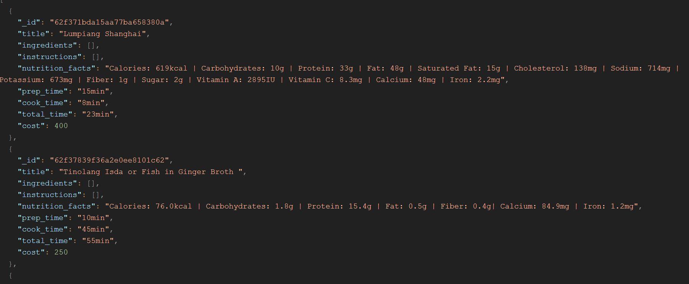

# FILIPINO RECIPES API

## Project Summary

### Project Context

FILIPINO RECIPES API is a database for cooks or ordinary people who want to cook or share Filipino food recipes the database has a recipe search engine makes easier to find recipes for what’s in your fridge, food recipes that fits your budget and can simply search title or find recipes that match their needs. Being motivated from watching different foreign taste Filipino foods in Philippines the database could provide and teach the users to cook and taste Filipino delicacies in the comfort of their own home.

### Project Goals

The database goal is to provide the user an easy way to find and share their own recipes by putting ingredients and instruction that other people can access to for them to try also to promote Filipino delicacies.

the database can be accessed [here](https://engroliver.github.io/Oliver-Assignment-1/).

### Justification for the project

To provide an convenient way to discover, find and monitor their callorie intakes while exploring filipino culture with their exotic food. At the comfort of their own home they do not need to go to philippines anymore to try and taste filipino delicacies.

### FEATURES

* Add new recipe to the data by /recipes/add

* Get recipe by title

* Get all Recipes by /recipes

* Get Recipes by cost

* Get Recipes by neutritional content

* Get Recipes by ingredients available in you're fridge.

* update recipe by /recipes/:recipeID

* delete recipe

* add review to recipe

* update review in recipe

* Register account

* Login account

* require JSON web token for every data

### SAMPLE MONGO DOCUMENT

### API DOCUMENTATION

 Title| Retrieve all recipes           
------------ | -------------
Method| GET
Endpoint Path | /recipes
Body| N/A
Parameters| Provide JSON  web token under authorization and check bearer
Expected Response | 

Title| Add Recipe           
------------ | -------------
Method| Post
Endpoint Path | /recipes/add
Body| 
Parameters |  <ul><li> Provide JSON  web token under authorization and bearer</li>    <li>title(string) : The title of recipe</li>   <li>ingredients(array):  The list of ingredients</li> <li>instructions(array): The instruction for preparation and cooking</li> <li>nutrition_facts(string):The Neutritions content of the food</li> <li>prep_time(string): The preparation time </li> <li>cook_time(string): The cooking time</li> <li>total_time(string):The total time to make the food</li> <li>servings(integer): The servings as per ingredients indecated</li> <li>cost(integer): The cost of food</li> </ul>
Expected Response|"status":200 {"message": "Recipe Added"}

Title| Retrive recipe by title           
------------ | -------------
Method| GET
Endpoint Path | /recipes?title=pork(the title example pork)
Body| N/A
Parameters |  Provide JSON  web token under authorization and check bearer 
Expected Response| 

Title| Get recipe by its cost           
------------ | -------------
Method| GET
Endpoint Path | /recipes?cost=500(the budget cost of you're meal in php ex.500)
Body| N/A
Parameters |  Provide JSON  web token under authorization and check bearer 
Expected Response|displays less than or equal the desired cost searched 

      